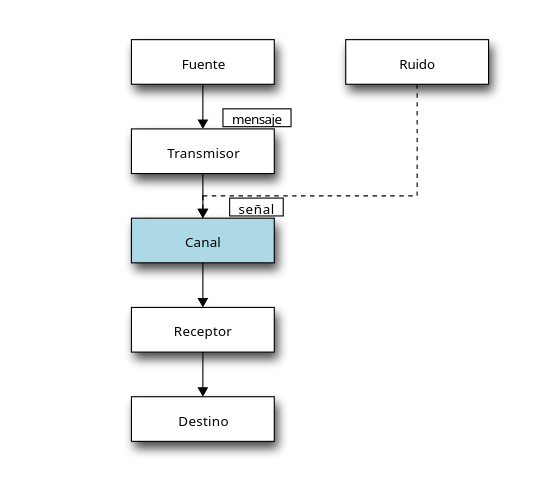
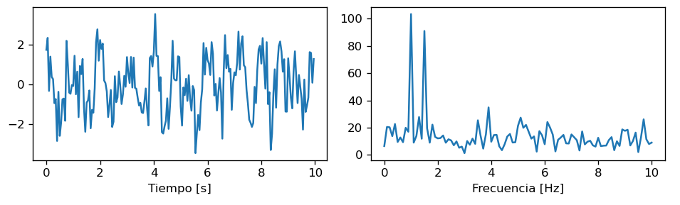

 # 1. Sistemas de comunicación

## 1.1 Modelo de Shannon

* __Mensaje__: Información que se envía.
* __Transmisor__: Transforma, codifica y transmite el mensaje. La transformación debe hacer la transmisión eficiente.
* __Ruido__: Va en la señal, pero no tiene relación con la información a enviar. Contamina el mensaje.
* __Señal__: Mensaje convertido por el transmisor que viaja por el canal.
* __Canal__: medio por el cual se envía el mensaje.
* __Receptor__: Captura la señal del transmisor para obtener el mensaje.

# 2. Señales

## 2.1 ¿Qué es una señal?

​	Una señal es una función del tiempo que entrega información sobre un fenómeno físico.
$$
f: x \rightarrow y
$$
​	Con:

* $x$ variable independiente. Tiempo, superficie o volumen
* $y$ variable dependiente: Potencial eléctrico, presión en el aire, intensidad de un pixel, etc.

## 2.2 Características de una señal

### 2.2.1 Energía

​	Es una medida del tamaño/área de la señal.
$$
E_g = ||g||=\int_0^T |g(t)|^2 dt
$$

### 2.2.2 Potencia

​	Mide la fuerza o intensidad de la señal.
$$
P_g = \lim_{T\rightarrow\infty} \frac{1}{T}E_g
$$

### 2.2.3 Razón señal a ruido (SNR)

​	Es una medida de la calidad de la señal.

## 2.3 Clasificación de señales

### 2.3.1 Clasificación #1	

El dominio de una señal se refiere al espacio en que corresponde.

* Señales continuas o tiempo discreto
* Señal análoga o digital

### 2.3.2 Clasificación #2

* Determinística: Puede describirse por una ecuación matemática
* Estocástica: Solo puede ser descrita probabilísticamente.

### 2.3.3 Clasificación #3

​	Se puede clasificar según su comportamiento en el tiempo.

* __Periódica__: Se repite luego de un cierto tiempo $P$. El tiempo se denomina __periodo__.
* __Aperiódica__: No se repite regularmente en el tiempo.

# 3. Análisis de señales

## 3.1 Notación

* Función tiempo continuo: $g(t)$.
* Función de tiempo discreto: $g[n]=g(t_n), t_n = nT_s, n \in [0,N]$ 

* Tiempo o intervalo de muestreo: $T_s$

## 3.2 Comparando señales: Covarianza y correlación cruzada

### 3.2.1 Covarianza

$$
\text{COV}_{gf}[m] = \frac{1}{N} \sum_{n=1}^N (g[n] - \bar g)(f[n+m] - \bar f)
\\
\bar g = \frac{1}{N} \sum_{n=1}^N g[n]
$$

### 3.2.2 Correlación cruzada

$$
\rho_{gf}[m] = \frac{\text{COV}_{gf}[m]}{\hat \sigma_g \hat \sigma_f}
\\
\hat \sigma_g = \frac{1}{N} \sqrt{\sum_{n=1}^N (g[n] - \bar g)^2}
$$

### 3.2.3 Resolución conda

~~~python
crosscorr = np.correlate(y1, y2, mode='full')/(len(x)*np.std(y1)*np.std(y2))
~~~

## 3.3 Autocorrelación

​	Permite analizar la __periodicidad__ de una función
$$
\rho_{gg}[m] = \frac{\text{COV}_{gg}[m]}{\hat \sigma_g^2}= \frac{1}{(N-m) \hat \sigma_g^2} \sum_{n=1}^{N-m} (g[n] - \bar g)(g[n+m] - \bar g)
$$

### 3.3.1 Resolución conda

~~~python
autocorr = np.correlate(y, y, mode='full')[len(x)-1:]/(len(x)*np.var(y))
~~~

## 3.4 Convolución

​	Es el producto punto entre versiones desplazadas de funciones.
$$
(f*g)[m] = \sum_n f[n] g[n-m]
$$

### 3.4.1 Resolución conda

~~~python
conv_s = np.convolve(functionA(t), functionB(t), mode='same')
~~~

## 3.5 Transformada de Fourier

$$
\begin{align}
G(f) &= \mathcal{F}[g(t)] = \int_{-\infty}^{\infty} g(t) \exp(-j2\pi f t) \,dt \\
&= \int_{-\infty}^{\infty} g(t) \cos(2\pi f t) \,dt - j \int_{-\infty}^{\infty} g(t) \sin(2\pi f t) \,dt
\end{align}
$$

​	La transformada de fourier es aplicada a una función en el tiempo, la cuál da como resultado otra función, pero que está en frecuencia.

​	Usaremos la siguiente función a modo de ejemplo:
$$
g(t)=\cos(2\pi \cdot 1 t) + \cos(2\pi \cdot 1.5t) + h(t)
$$
​	Siendo $h(t)$ ruido.

​	En la imagen de la izquierda se puede ver una función en el tiempo. En la imagen de la derecha está la función después de aplicarle la transformada de Fourier.

​	El dominio de la imagen de la derecha ya no está en el tiempo, sino que está en frecuencia. Esto es conocido como el __espectro de amplitud__, e indica la distribución de energía que tiene la señal original. 

​	Se puede ver en el espectro de amplitud, que tiene picos en $1$ y $1.5$. Esto coincide con los componentes de la función. De esta manera, se puede descubrir fácilmente la __periodicidad__ de la función.

### 3.5.1 Propiedades

* La transformada de Fourier es invertible.

$$
g(t) = \mathcal{F}^{-1}[G(f)]
$$

* La convolución en el tiempo se convierte en multiplicación en frecuencia y viceverza.

$$
\mathcal{F}[g(t)*y(t)] = \mathcal{F}[g(t)] \mathcal{F}[y(t)] = G(f) Y(f)
$$

* La transformada de Fourier es lineal.

$$
\mathcal{F}[a g_1(t) + b g_2(t) ] = a G_1(f) + b G_2(f)
$$

### 3.5.2 Teoremas

* Teorema de Parseval: La energía de una señal se preserva. La transformada de Fourier no pierde información.
* Teorema de Wiener-Khinchin: la densidad espectral es la potencia asignada a cada frecuencia de señal.

## 3.6 Transformada de Fourier discreta (DFT)

$$
G[k] = \sum_{n=0}^{N-1} g[n] \exp \left( -j 2\pi \frac{k n}{N} \right)
$$

​	Esta transformada, la podemos escribir como:
$$
G[k] = \sum_{n=0}^{N-1} g[n] W_N^{kn}
$$
​	Siendo:
$$
W_N = \exp \left( -j \frac{2\pi}{N} \right)
$$
​	Lo anterior se puede expresar de forma matricial, obteniendo:
$$
\begin{align}
\begin{pmatrix} 
G[0] \\
G[1] \\
G[2] \\
\vdots \\
G[N-1] \\
\end{pmatrix} &=
\begin{pmatrix}
1 & 1 & 1 & \cdots & 1 \\
1 & W_N & W_N^2 & \cdots & W_N^{N-1} \\
1 & W_N^2 & W_N^4 & \cdots & W_N^{N-2} \\
\vdots & \dots & \dots & \ddots &  \vdots \\
1 & W_N^{N-1} & W_N^{N-2} & \cdots & W_N \\
\end{pmatrix} 
\begin{pmatrix} 
g[0] \\
g[1] \\
g[2] \\
\vdots \\
g[N-1] \\
\end{pmatrix} \nonumber  \\
G &= \Omega g,
\end{align}
$$

### 3.6.1 Resolución conda

~~~python
def matrix_DFT(signal):
    N = len(signal)
    W_N = np.exp(-1j*2*np.pi/N)
    n = np.arange(N)
    Omega = W_N**(n*n.reshape(1,-1).T)
    S = np.dot(Omega, signal)
    return S
~~~

## 3.7 Transformada rápida de Fourier

Es un algoritmo que permite ahorrar costo de cómputo al calcularla.
$$
G[k] =  G_E[k] + \exp \left( -j2\pi \frac{k}{N} \right) G_O[k], ~~~ \forall k \in [0,N/2] 
\\
G[k + N/2] =  G_E[k] - \exp \left( -j2\pi \frac{k}{N} \right) G_O[k] \\
$$

### 3.7.1 Resolución conda

~~~python
G = fft.fft(g)
freq = fft.fftfreq(n=len(g), d=1/Fs)
ax.plot(freq, np.abs(G))
~~~

# 4. Introducción al procesamiento de imágenes

## 4.1 Definiendo una imagen digital

​	La imagen digital es una señal con:

* Dos variables independientes discretas $x$ e $y$ que representan el espacio
* Una o más variables dependientes $I(x,y)$ que representan la intensidad del color según una codificación.

​	En la práctica, las imágenes digitales son un arreglo $NxM$ y $x, y$ representan una posición dentro de esta matriz

​	Los píxeles pueden ser:

* Unidimensionales (B/N)
* multidimensionales (RGB, etc)

​	Un pixel se representa como una tupla donde cada componente:

* Es un entero sin signo de 8bits: Intensidad de rango [0,255]
* Es un valor flotante en el rango [0.0,1.0]

## 4.2 Qué representa una imagen

​	Una imagen, al ser un tipo de señal, quiere decir que está entregando algún tipo de información. Por lo general, una imagen es una representación de la intensidad lumínica.

# 5. Análisis de imágenes en el dominio de la frecuencia

## 5.1 Transformada de Fourier bidimensional

$$
G[k_1, k_2] = \sum_{n_1=0}^{N_1-1} \hat g_{n_2}[n_1] \exp \left (-j2\pi \frac{n_1 k_1}{N_1}\right)
$$

## 5.2 Resolución en conda

​	La imagen debe ser exportada a B/N

~~~python
img_bw = color2bw(img_color)
S = fftpack.fft2(img_bw)
...
ax.imgshow(fftpack.fftshift(np.abs(S)))
~~~

​	Para visualizar mejor el espectro de una imagen natural, se recomienda usar:
$$
\log(|\text{fft2}(I)|+1)
$$

~~~conda
ax.imgshow(fftpack.fftshift(np.log(1+np.abs(S)))
~~~

# 6. Transmisión y compresión

​	El __transmisor__  del modelo de Shannon puede subdividirse en cuatro etapas:

1. Transformación: Cambia la representación de los datos.

2. Cuantización: Es opcional. Reduce los valores posibles de la señal. Transforma los datos e involucra pérdida.

3. Codificación de fuente:  Codifica la información usando "menos bits" que la original. Existe compresión _Lossless_ y _Lossy_.

4. Codificación de canal

## 6.1 Algoritmo JPEG

### 6.1.1 Paso #1: YCbCr 4:2:2

​	Se convierte de RGB a YCbCr y luego se reduce la resolución de los canales chroma con respecto al canal de luminancia.

Esto debido a que somos más sensibles a la iluminación que al color.

### 6.1.2 Paso #2: DCT en bloques de 8x8

​	Se aplica secuencialmente en bloques disjuntos de 8x8 píxeles.

​	Cada bloque se lleva al dominio de la frecuencia usando la transformada discreta coseno (DCT)

​	DCT es lineal y cumple con el principio de conservación de energía.

​	Podemos usar el algoritmo FFT para calcular eficientemente la DCT

### 6.1.3 Paso #3: Cuantización con matriz Q

​	Cuantiza cada matriz DCT y reduce la "cantidad de valores posibles".
$$
\begin{split}
\begin{equation}
    Q(x)=
    \begin{cases}
      r_0, & x \in [d_0, d_1) \\
      r_1, & x \in [d_1, d_2) \\
      \vdots & \vdots \\
      r_i, & x \in [d_i, d_{i+1}) \\
      \vdots & \vdots \\
      r_{L-1}& x \in [d_{L-1}, d_{L}) \\
    \end{cases}
\end{equation}
\end{split}
$$
​	Un caso particular es la __cuantización uniforme__, donde la diferencia entre los niveles $q$ es constante.
$$
x_q = -V + \frac{q}{2} + q\cdot \text{floor}\left(\frac{x+V}{q} \right)
$$

### 6.1.4 Paso #4: Codificación de Huffman

# 7. Teoría de la información

​	Proporciona medidas para describir la información de un proceso: __Entropía__ e __Información mutua__.